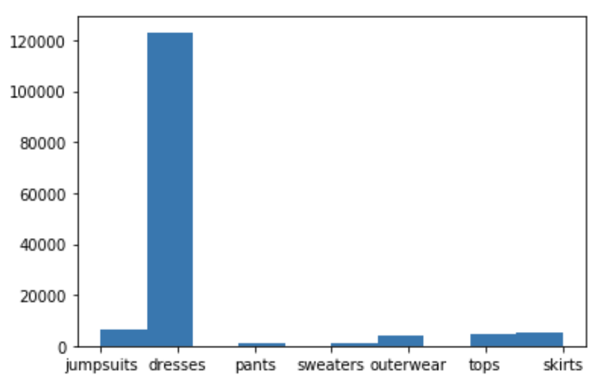
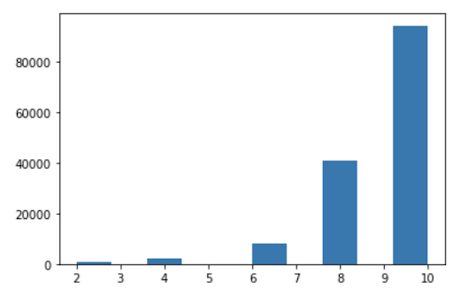
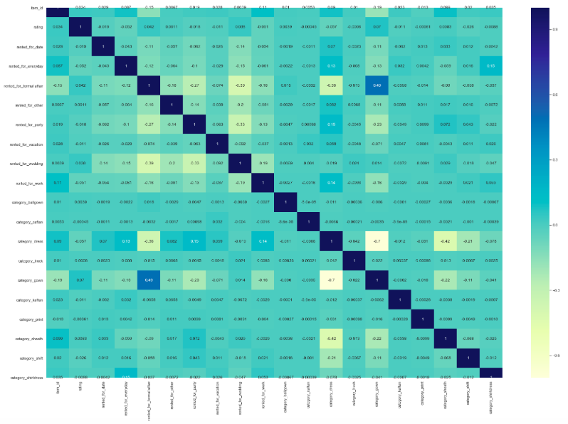
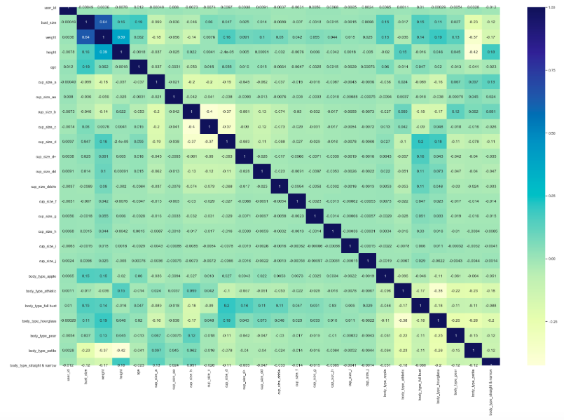

Rent the Runway Recommendation Engine
-
To view the code used for this project, please see 

  - 
    - Decomposing fit semantics for product size recommendation in metric spaces, Rishabh Misra, Mengting Wan, Julian McAuley, RecSys, 2018

Objective
-
- To predict item ratings
- To create content-based item recommendation engine

Data Processing
-
- Drop NAN values, remove strings from weight and convert to integer, remove spaces from column names, drop extraneous columns
- Engineer generalized categories for item types (from 68 categories to 7)
- Create separate dataframes for user data features and item features

EDA
-
- The most common item type in the dataset was dresses.

- Item ratings tended to be high. Users were given the option to rate items on a 1-5 scale, though data was recorded on a 1-10 scale, hence the binning around even numbers.

- No significant correlation was found between items

- No significant correlation was found between users

 
K-Nearest Neighbors Baseline Model
-
- For our baseline model, we limited our study to dresses only where the item count was < 20

- Parameters: pearson, user_based
- Result: RMSE 1.48

Rating Prediction: Singular Value Decomposition
-
- To predict an item rating, we limited our model to analyze dresses only, where the user count was > 15, and the item count was > 15. This limited the study to 1400 unique items and 200 unique users, about 3800 ratings total.

- Result: RMSE 1.30

- Next, we used MinMaxScalar to improve our SVD Model with hyperparameters tuned by GridSearchCV. Rating predictions were more normally distributed, though RMSE did not improve

Content-Based Recommendation Engine
-
- Our content-based recommender used cosine similarity based on the average rating for a dress. Here we also used MinMaxScaler to ensure a more normal distribution.
